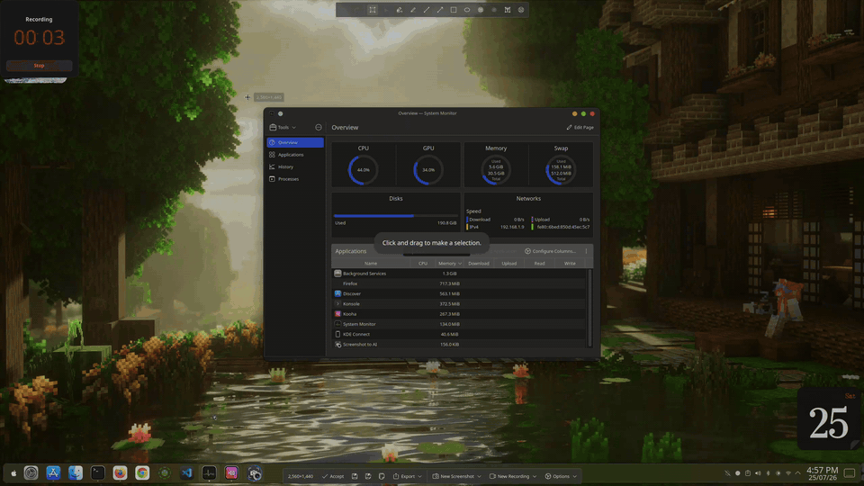

# Screenshot to AI

**Circle to Search for the Linux desktop.** Press a hotkey, drag a box around
anything on screen, and your screenshot lands in your chosen AI page — ready to
paste and ask.

<!-- TODO: record a 5-second demo GIF (press key -> drag box -> AI answers) and embed it here:  -->

## How it works

1. Press your hotkey (default `Meta+Shift+Z`).
2. Drag a box around the thing you want to ask about.
3. Your browser opens to the AI you chose, with the image on your clipboard.
4. Click the search box, press **Ctrl+V**, type your question, hit Enter.

Your normal `PrtSc` screenshot keeps working exactly as before — this is a
separate, additive hotkey.

## Requirements

- **KDE** (uses `spectacle`, ships with Plasma) or **GNOME** (uses `gnome-screenshot`)
  - On Ubuntu/Debian GNOME, install it if missing: `sudo apt install gnome-screenshot`
- `notify-send` (libnotify) for the capture confirmation
- A default browser (`xdg-open`)

## Install

```bash
git clone <your-repo-url> screenshot-to-ai
cd screenshot-to-ai
./install.sh
```

The installer copies the engine to `~/.local/bin`, asks which AI to use, asks for
your hotkey, and registers it.

- **KDE:** the shortcut activates after you **log out and back in** (KDE only loads
  command shortcuts at session start).
- **GNOME:** the shortcut works immediately.

## Configuration

Edit `~/.config/screenshot-to-ai/config`:

```bash
# Where to send the screenshot. Presets:
#   Google AI Mode : https://www.google.com/search?udm=50   (default)
#   ChatGPT        : https://chatgpt.com/
#   Perplexity     : https://www.perplexity.ai/
#   Google Gemini  : https://gemini.google.com/app
#   Claude         : https://claude.ai/new
AI_URL="https://www.google.com/search?udm=50"

# region | fullscreen | window
CAPTURE_MODE="region"

# Optional override: spectacle | gnome-screenshot
# BACKEND="spectacle"
```

To change the hotkey later: re-run `./install.sh`, or set it in your desktop's
keyboard settings (KDE: System Settings → Shortcuts; GNOME: Settings → Keyboard →
Custom Shortcuts).

## Supported setups

- **KDE Plasma 6 (Wayland):** tested.
- **GNOME:** community-tested — please report results.

## Troubleshooting

- **Hotkey does nothing (KDE):** log out and back in; KDE only registers command
  shortcuts at session start.
- **Browser didn't open:** the image is still on your clipboard; check that
  `xdg-open` works and you have a default browser set.
- **"Unsupported desktop":** auto-detect didn't find KDE/GNOME. Set `BACKEND` in the
  config and bind the hotkey manually.
- **"Capture tool not found":** the screenshot backend isn't installed. On GNOME:
  `sudo apt install gnome-screenshot`. On KDE, install `spectacle`.

## Uninstall

```bash
./uninstall.sh
```

## Roadmap

- Best-effort auto-paste (opt-in, via `ydotool`) so you skip Ctrl+V
- KDE Spectacle "Send to AI" entry (Purpose plugin) for native PrtSc integration
- OCR / text mode (grab the text in the region instead of the image)
- Also-save a copy of the screenshot to a folder
- Multiple hotkeys → multiple AIs
- Packaging: AUR and Flathub

## License

MIT — see [LICENSE](LICENSE).
